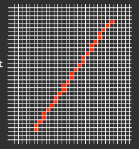

# What will we cover?

* Multimedia
* Visual Perception
* Bitmap Images
* Vector Graphics
* Networked Multimedia and the Web
* Multimedia Design
* Interactive Web Site Development
* Digital Video and Web Video
* Mobile
* iOS and iPhone
* Audio
* Analogue to Digital
* Audio Compression and Storage

# Reading

* Digital Multimedia: Chapman, 3rd Ed, Wiley (2009)

# What is Multimedia?

*"Using more than one medium of expression, communication etc."*

*"The provision of audio and video material cross-referenced to a computer text"*

* An interactive presentation that includes at least two of the following:

  * Text
  * Sound
  * Graphic images
  * Motion graphics

* Multimedia computers serve as two primary functions:

  * Development tools (Adobe, Apple, Unity etc.)
  * Delivery medium for multimedia presentations (browser plug-ins)

  

# Electromagnetic Spectrum

* Radio waves have long wave lengths and low energy
* Gamma rays have short wave lengths and high energy

* Visible light is one component of many waveforms in the electromagnetic spectrum (400-700nm)

* All electromagnetic waves travel at the speed of light

# Light

Light is measured in terms of its:

* Radiance (watts) - Total energy emitted
* Luminance (lumens) - Light strength perceived by the human eye
* Brightness - Subjective measure of how bright it appears to be

# Colour Vision

The retina contains two sorts of light receptor cells:

* Rods (~120 million)
  * Detects shades of black and white
  * In the peripheral vision
  * Work in low light - night vision
* Cones (~6 million)
  * Sensitive to colour
  * Mainly central
  * Works with bright light
  * Sensitive to 3 general bands of electromagnetic radiation (red, green, blue)

# Colour

* Most colours can be made by combining different amounts of Red, Green and Blue light
* Active sources such as monitors produce colours by emitting different wavelengths of light
  * Active displays emit combinations of Red, Green and Blue (RGB) light
* Passive sources such as printed documents produce colours by absorbing wavelengths and reflecting others
  * Passive displays have the colours Cyan, Magenta and Yellow (CMY)

# Colour Sensitivity

* The eye is not equally sensitive to all colours
* The eye is more sensitive to Green, then Red, and then Blue
* Human eyes respond to more factors than just dominant wavelength
  * Luminance/Brightness - intensity of light
  * Saturation - how pure the colour is / how much the colour is diluted by white light
  * Chromaticity/Hue - purity and dominant frequency

# Digital Images

* Digital images are often referred to as bitmaps
* The more pixels, the higher the resolution, the better the quality
* Image resolution determines the quality and the storage requirements

# Aspect Ratio

* Expresses the resolution of an image
  * Number of horizontal pixels x vertical pixels
* HDTV - 1920 x 1080
* 4K - 3840 x 2160

# Image Formats

* Need to store image data in a consistent manner
* Formats enable standardisation

# Graphical Information

* Two principle methods of representing graphical data:
  * Bitmaps (raster/pixel maps)
  * Vectors

## Bitmaps

* Made up of pixels in a grid
* Work well at representing variations in colours, shades and shapes by are vulnerable to aliasing

# Compression

* Two types of compression that is applied to digital media (audio/video/text etc.):
  * Lossless compression
  * Lossy compression

## Lossless Compression

* Run length encoding
* Compresses data by storing it in a more appropriate way
  * 11111111111111111100000111111111 (4 bytes long)
  * 18, 5, 9 (3 bytes long)
* Guaranteed to not lose important data
* Rarely gives compression better than 2:1

## Lossy Compression

* Removes parts of the data without it being too noticeable
  * The eye is relatively poor in distinguishing differences in chrominance (changes in colour)

## GIF

* Graphic Interchange Format
* Palette of only 256 colours
* Uses LZW **lossless** compression

## Animated GIFs

* Produced by defining several images within a GIF file and displaying them sequentially
* Not very good for large/long animations

## JPEG

* Joint Photographic Experts Group
* Lossy compression
* Full colour images (24-bit/true colour)
  * unlike GIFs that are limited to a maximum of 256 colours
* Achieves compression ratios of 30:1

## PNG

* Portable Network Graphics (similar to GIF)
* Lossless compression
* Better quality reproduction than GIF, but no animation
* Transparency

# Vector Graphics

* Vector images are made up of individual, scalable objects
* These objects are defined by mathematical equations rather than pixels
* These objects may consist of lines, curves, and shapes
* Unsuitable for producing photo-realistic imagery

## Coordinates and Vectors

* We identify any individual pixel by its x and y coordinates
* Two points define a vector: 1,1 and 6,9

## Why Vector Graphics?

* Smaller than bitmap equivalents
* Retain semantic information lost by bitmap forms
* For 3D work, bitmap formats are impractical
* Vector displays always look precise (no/little aliasing)

# Aliasing

* Modern displays are made up of discrete pixels, so coordinate values can only be integers
* This gives diagonal or curved lines a *stepped* appearance

|  |  |  |
| :---------------------------------: | :--------------------------------: | :--------------------------------: |
|             No aliasing             |      Aliasing with gridlines       |     Aliasing without gridlines     |

* Rendering a vector as an image made of pixels can be considered as a type of sampling and reconstruction
* As the resolution of the display increases, jagged edges become less pronounced

# Anti-Aliasing

* To reduce the impact of aliasing, the display software can insert pixels of different intensity around the line
* The intensity level of the pixel depends on the proportion of the original line that runs through that pixel

# Vector Primitives

Fundamental objects used to create vector images:

* Lines
* Rectangles
* Ellipses (and circles)
* Regular polygons
* Polylines
* Bezier Curves

# Resolution Advantages

* Although converting vector graphics to a pixel based display can cause aliasing, vector graphics scalability can give much better results than bitmaps

# File Formats

* Scalable Vector Graphics (SVG)
  * Uses Extensible Markup Language (XML)

# 3D Modelling

* Vector representations are the main representations used in 3D modelling
* Generally 3D modelling refers to projecting 3D models on a 2D screen (rendering and rasterisation)
* Many approaches to modelling objects in 3D, main ones being:
  * Constructive Solid Geometry - box modelling
  * Free Form Modelling - patch modelling
  * Procedural Modelling 

# The Internet

* An interconnected set of networks

* Billions of computers, all linked together

* Home computers are linked to the Internet using a phone line and a modem through their Internet Service Provider (ISP)

* A computer in a business/university has a Network Interface Card (NIC) that directly connects it to a Local Area Network (LAN)

  * The business then connects the LAN to an ISP

  

# History

* Developed by the US Department of Defence in 1969
* Advanced Research Projects Agency ARPAnet
* 1980s the Domain Name System (DNS) was introduced

# IP Address

* Every device connected to the Internet must have an IP address, whether it's a host or web server etc.
* Each computer connected will have a 32 bit IP address
  * 139.184.13.14 = 10001011.10111000.00001101.00001110
  * 256 x 256 x 256 x 256 = 4.3 Billion

# URL

* Uniform Resource Locator
* Each IP address is linked to a URL (vice versa) and a lookup table (DNS) is required to match the two
  * www.sussex.ac.uk = 139.184.13.14

# DNS

* Domain Name System

* The DNS is a database that resolves URL to IP address

# The World Wide Web

* Client-Server system
* Web resources identified by ULR that are accessible over the Internet
* Resources are transferred via HTTP, and are usually accessed by users through a web browser
* Invented by Tim Berners-Lee in 1989

# Web Fundamentals

* Pages are defined by HTML
* Most important elements of web pages are hyperlinks to other resources on the same server
* Links allow progression from one page to another and comprise of two parts:
  * Visible link or anchor
  * Target of link, described by a URL

# HTTP

* Stateless protocol (it does not maintain connection information)
* Protocol for communication over the Internet
* Client opens a TCP connection to the Web Server and sends a HTTP header that includes:
  * GET, PUT, POST 
  * Authentication information
  * Cookies
* Server transmits a reply header back to the client, along with any data

# Cookies

* State information is achieved via cookies
* A piece of text that a web server can store on the client-side
* Pieces of information saved as name-value pairs
  * User-ID | DK10098DK
* When requesting access to a server, your browser will look on your machine for a cookie to that website
* If one exists, your browser will send all name-value pairs to the server along with the URL request
* If none exist, the server knows you have not visited before and will create a new cookie
* E-commerce websites use cookies for their shopping carts

# Third Party Cookies

* Cookies have important implications for the privacy and anonymity of web users
* A web page may contain images or other components stored on servers in other domains
* Cookies that are set during retrieval of these components are called third-party cookies
* Advertising companies use third-party cookies to track a user across multiple sites
* An advertising company can track a user across all pages where it has placed advertising images
* This allows the company to target adverts to the user's presumed preferences

# HTML

* Hyper Text Markup Language
* File format for the Web
* Text-based
* Informs the web browser how to construct a page

# XHTML

* Extensible Hyper Text Markup Language
* Conforms to XML syntax
* Stricter than HTML
* Extensive set of existing XML tools can be used

# HTML5

* New major version of HTML
* Includes features such as video playback, drag-and=drop that have previously required browser plug-ins such as Flash

# Web Sites

* Web pages represent visual information in the WWW
* Need more than a mark-up language to make web pages truly interactive

# HTML and Friends

* HTML5 requires other supporting technologies and content for modern web pages to work
  * Cascading Style Sheets
  * JavaScript
  * Scalable Vector Graphics
  * Dynamic Technologies (MySQL, PHP)
* HTML5 files contain the key content for web pages
* Most of the formatting is implemented using CSS
* Interactivity is implemented using JavaScript

# HTML Elements

* A HTML element is everything from the start tag to the end tag

  * \
This is a paragraph\

  * \<a href="default.html">This is a link\<\a>
  * \ 

* New semantic/structural elements:

  * \<article>
  * \<footer>
  * \<nav>
  * \<section>

  

# Cascading Style Sheets

* Style sheets can be used to define how different elements, such as fonts, colours, etc appear in a web document
* These style sheets can then be applied to any Web page
* Style Sheets can be:
  * External (most powerful, cleanest and popular)
    * Must be referenced from your HTML page \<link rel="stylesheet" href="style.css" type="text/css" />
  * Embedded
  * Inline

# CSS Rules/Selectors

* Each rule consists of a selector followed by a list of properties
* Selectors can just be names or existing tags, e.g. the paragraph tag \

# \
 Tag

* A container that styles can be applied to
* Has no default formatting information

# CSS Classes/IDs

* Classes can be used multiple times in HTML document
  * .important {color: blue; font-weight: bold;}
  * \
Text here\

* IDs used to refer to items which only occur once
  * #footer {font-size: small;}
  * \
Text here\

# Units of Measurement

CSS specifies 8 units of length measurement, which are either relative or absolute

* em - Relative - height of the elements font
* ex - Relative -  height of x character of the font
* px - Relative - pixels
* in - Absolute - inches
* cm - Absolute - centimetres
* mm - Absolute - millimetres
* pt - Absolute - points (1 pt is 1/72 inches)
* pc - Absolute - picas (1 PC IS 12 points)

# JavaScript

* Must be embedded in the HTML document
* Most effective when used from a separate file

# Dynamic Web Pages

* Content is changing
* Processing is performed
  * Server-side scripting
  * Client-side scripting

# Server Side Scripting

* Dynamic web server in which page requests are fulfilled by running a script directly on the web server to generate dynamic HTML pages
* These scripts reside either in the HTML document or in another document pointed to from the HTML document
* Generally most functionality is performed by both an executing script and a database

There are many server side scripting technologies:

* PHP
* ASP.net
* Python
* JSP

## PHP

* Script is embedded into the page along with the HTML and is run when the page is requested
* Open source, cross platform and free
* Parses code within its delimiter tags
* Anything outside these tags (HTML) is sent directly to the output and is not parsed by PHP

## Active Server Pages (ASP)

* Microsoft technology that enables dynamic web pages using VB Script or C#
* Pages contain code that the server executes
* Code can do anything such as read databases, run other programs, etc.

## Java Server Pages (JSP)

* Java Server Pages are an extension to the Java servlet technology that was developed by Sun
* Dynamic scripting capability that works in tandem with HTML code

## Python

* Interpreted high level programming language for general purpose programming
* Requires a web framework such as Django, Flask etc

## Server Side Applications

* Common Gateway Interface (CGI) defines a standard interface between a Web Server and an independent application
* CGI is very general because application is completely decoupled from the Web Server
* No convenient place to store state information between web requests

* CGI applications can be written using any language that the application machine can execute:
  * Perl, Java, C++, C etc

# Server Side vs Client Side

* All of the dynamic web page technologies so far have been server based
  * The server runs the script/application
  * Code is not visible to the client
  * The client gets sent formatted HTML

# Client Side

* Scripts are programs that run inside an Internet browser on the client machine
* Small programs in the source form of an interpreted language are embedded directly into the Web Page
* Browser has a built-in interpreter that reads the script code it finds in the page and runs it

## Plug-ins

* Add on software application that permits software developers to add new capabilities to the browser using a defined programming interface
* Provides the ability to display a new type of data using the browser itself rather than starting a separate application

## Java

* Object oriented programming language
* Compiles to Java byte code, able to run on any instantiation of a Java Virtual Machine

### Java Applets

* Browsers include a Java Virtual Machine
* Applets are downloaded from the server and run on the browsers virtual machine - Java Runtime Environment (JVE)
* Even though they are run on the client, Java applets are restricted so that they cannot damage the client machine
* Now deprecated since Java 9

# Digital Video

* Digital videos are a series of still images
* Images take up storage space
* Movies are traditionally 24 frames per second
  * Less than 15 fps is noticeable
* HD video is 1920x1080

# Video Compression

* Video compression relies on the encoding and decoding of video data
* Algorithms that handle compression/decompression are known as codecs

# Formats and Codecs

* Formats are required for storage and transmission of video data
* Often a format will specify several different encoding methods

# M-JPEG

* Motion-JPEG - based on the JPEG still image format
* Stores every frame as a compressed bitmap image
* Compression ratios of between 2:1 and 12:1

# Types of Apps

* Web Apps - HTML5, CSS, JavaScript
* Hybrid Apps - Native shell with HTML content
* Native Apps - Written i native code - still uses internet to connect with servers

# Display

* Small
* High resolution
* Touch
* Difficult to multitask between apps

# Processor

* ARM
* ARM Holdings design chips which are then licensed
* These are low in power usage
* Designs are modified by phone manufacturers

# Features

* Gyroscope

* Accelerometer
* Compass/Magnetometer
* GPS
* Bluetooth
* Near Field Communication (RFID)

# Software

* iOS - Apple
* Android - Google, Samsung, HTC

