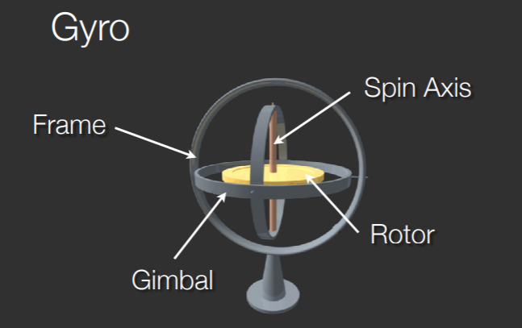

# Types of Apps

* Web Apps - HTML5, CSS, JavaScript
* Hybrid Apps - Native shell with HTML content
* Native Apps - Written i native code - still uses internet to connect with servers

# Display

* Small
* High resolution
* Touch
* Difficult to multitask between apps

# Processor

* ARM
* ARM Holdings design chips which are then licensed
* These are low in power usage
* Designs are modified by phone manufacturers

# Features

* Gyroscope

* Accelerometer
* Compass/Magnetometer
* GPS
* Bluetooth
* Near Field Communication (RFID)

# Software

* iOS - Apple
* Android - Google, Samsung, HTC

