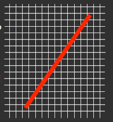
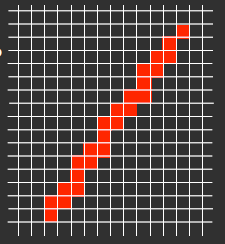
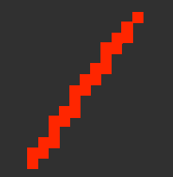
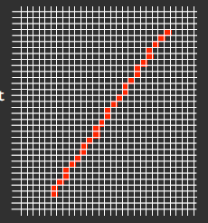

# Vector Graphics

* Vector images are made up of individual, scalable objects
* These objects are defined by mathematical equations rather than pixels
* These objects may consist of lines, curves, and shapes
* Unsuitable for producing photo-realistic imagery

## Coordinates and Vectors

* We identify any individual pixel by its x and y coordinates
* Two points define a vector: 1,1 and 6,9

## Why Vector Graphics?

* Smaller than bitmap equivalents
* Retain semantic information lost by bitmap forms
* For 3D work, bitmap formats are impractical
* Vector displays always look precise (no/little aliasing)

# Aliasing

* Modern displays are made up of discrete pixels, so coordinate values can only be integers
* This gives diagonal or curved lines a *stepped* appearance

|  |  |  |
| :---------------------------------: | :--------------------------------: | :--------------------------------: |
|             No aliasing             |      Aliasing with gridlines       |     Aliasing without gridlines     |

* Rendering a vector as an image made of pixels can be considered as a type of sampling and reconstruction
* As the resolution of the display increases, jagged edges become less pronounced

|  |
| :--------------------------------: |

# Anti-Aliasing

* To reduce the impact of aliasing, the display software can insert pixels of different intensity around the line
* The intensity level of the pixel depends on the proportion of the original line that runs through that pixel

# Vector Primitives

Fundamental objects used to create vector images:

* Lines
* Rectangles
* Ellipses (and circles)
* Regular polygons
* Polylines
* Bezier Curves

# Resolution Advantages

* Although converting vector graphics to a pixel based display can cause aliasing, vector graphics scalability can give much better results than bitmaps

# File Formats

* Scalable Vector Graphics (SVG)
  * Uses Extensible Markup Language (XML)

# 3D Modelling

* Vector representations are the main representations used in 3D modelling
* Generally 3D modelling refers to projecting 3D models on a 2D screen (rendering and rasterisation)
* Many approaches to modelling objects in 3D, main ones being:
  * Constructive Solid Geometry - box modelling
  * Free Form Modelling - patch modelling
  * Procedural Modelling 

