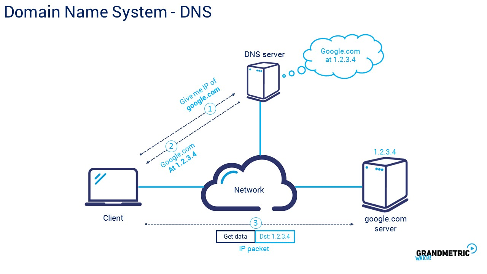

# The Internet

* An interconnected set of networks

* Billions of computers, all linked together

* Home computers are linked to the Internet using a phone line and a modem through their Internet Service Provider (ISP)

* A computer in a business/university has a Network Interface Card (NIC) that directly connects it to a Local Area Network (LAN)

  * The business then connects the LAN to an ISP

  

# History

* Developed by the US Department of Defence in 1969
* Advanced Research Projects Agency ARPAnet
* 1980s the Domain Name System (DNS) was introduced

# IP Address

* Every device connected to the Internet must have an IP address, whether it's a host or web server etc.
* Each computer connected will have a 32 bit IP address
  * 139.184.13.14 = 10001011.10111000.00001101.00001110
  * 256 x 256 x 256 x 256 = 4.3 Billion

# URL

* Uniform Resource Locator
* Each IP address is linked to a URL (vice versa) and a lookup table (DNS) is required to match the two
  * www.sussex.ac.uk = 139.184.13.14

# DNS

* Domain Name System

* The DNS is a database that resolves URL to IP address

